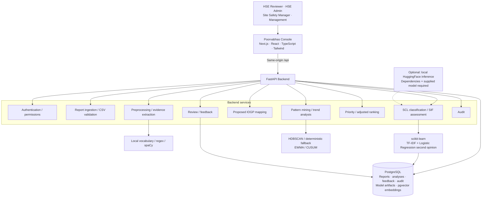

# Poorvabhas

AI/NLP-based HSE decision support for identifying Serious Injury & Fatality (SIF)-potential precursors in safety reports.

> Detecting fatal potential before the outcome.

**Decision support for identifying fatal potential before the outcome.** Poorvabhas examines hazard, energy and control evidence in free-text reports, explains its assessment, and helps a human HSE reviewer decide which cases need attention.


**SIH 2026 · Problem Statement 26165 · Oil India Limited (OIL)**

**DEMO ENVIRONMENT — SYNTHETIC SAFETY DATA.** Seeded reports, site profiles, contractors and exposure hours are synthetic/proxy data. This repository does not contain confidential OIL production reports. Poorvabhas is a prototype with a human review workflow; real-world effectiveness requires an independently labelled pilot.

**Evaluator starting point:** [Local setup](#15-local-setup) → [Demo walkthrough](#18-evaluator-demo) → [Testing and evaluation](#19-testing--evaluation).

## 1. SIH 2026 Problem Statement

**Problem Statement ID:** 26165

**Title:** AI/NLP Engine to Detect Serious Injury & Fatality (SIF) Precursors in OIL's Unsafe-Act/Unsafe-Condition and Near-Miss Reports

The problem statement concerns reviewing large volumes of Unsafe Act / Unsafe Condition (UA/UC), Near-Miss and Incident reports. Outcome-based review can overlook a low-consequence event describing conditions capable of producing serious injury or fatality. An unverified isolation with residual pressure remains an important precursor even when work stops before anyone is hurt.

Poorvabhas focuses on the underlying hazard, energy and control evidence. Its implementation demonstrates a review workflow using synthetic reports, without assuming access to OIL's private operational systems.

## 2. Solution Overview

Poorvabhas turns a safety narrative into an evidence-supported assessment, proposed rule mapping, recurring-pattern context and review priority. The final HSE decision remains with a human reviewer.

```text
Report → Text Understanding → Evidence Extraction → Energy + Control Assessment
       → SCL Classification → SIF/PSIF Potential Assessment
       → Proposed IOGP LSR Crosswalk → Pattern Mining / Recurrence Context
       → Priority Scoring → HSE Review → Controlled Feedback / Retraining
```

The per-report pipeline checks recurrence and existing pattern matches; pattern mining is a separate dataset operation during seeding, CSV import, bulk reanalysis or an explicit admin action. Creating a single report does not re-mine the dataset. Reviewer feedback is stored for later controlled retraining.

The default intelligence combines deterministic vocabularies, phrase/regex matching, abbreviation normalization and spaCy sentence segmentation with a **TF-IDF + Logistic Regression classifier second opinion**. The SCL engine determines classification; classifier disagreement can route a case to review. If the classifier is unavailable, deterministic analysis remains available.

## 3. Key Capabilities

### Report Ingestion

- Manual entry of **Unsafe Act, Unsafe Condition, Near Miss and Incident** reports.
- CSV validation, row preview, error reporting and import of valid rows through the analysis pipeline.
- Required context: report type, date, site, location, activity and description.
- Search, filters, pagination and report investigation links.

CSV validation sessions are database-backed, tied to the validating user and expire after 30 minutes. Uploads are capped at 4 MB. See [sample-import.csv](docs/sample-import.csv).

### NLP & Evidence Extraction

The extractor identifies activity, hazard, energy source, barrier/control, location, equipment, failure mode, human behavior, injury outcome and environmental context. Exposure context comes from supported narrative evidence and structured fields, such as pedestrian exposure, shift or weather; it is not a separately measured exposure estimate.

Each supported extraction retains its source, canonical label, confidence and original text span where available. Barrier states distinguish present, failed, absent, mentioned and conflicting controls. Missing evidence is not filled with fabricated text: unsupported fields show **Not stated**, and unresolved gates show **Insufficient information**.

### SIF / PSIF Classification

The prototype implements a Safety Classification and Learning (SCL)-based decision tree:

| Gate | Question | Evidence considered |
| --- | --- | --- |
| Q1 | High energy present? | Energy phrases and supported control-to-energy inference |
| Q2 | High-energy event / energy released? | Release/contact language, prevention language and report type |
| Q3 | Direct control in place? | Barrier presence, failure, absence or conflict |
| Q4 | Serious injury? | Injury narrative, structured severity and report type |

Each gate returns **YES / NO / INSUFFICIENT**, with rationale and evidence. Structured fields are labelled separately from narrative spans. Explicit rules also apply: an isolation barrier can imply hazardous energy, and UA/UC report types can support a no-release answer. These are visible rule-based interpretations, not independently verified facts; weak or conflicting evidence may require HSE review.

| SCL class | Implemented decision path |
| --- | --- |
| **HSIF** | High energy, an energy event and serious injury/fatality |
| **PSIF** | High energy, an energy event, no serious injury and absent/failed direct control |
| **Exposure** | High energy, no energy event and absent/failed direct control |
| **Capacity** | High energy, an energy event, no serious injury and direct control present |
| **Success** | High energy, no energy event and direct control present |
| **LSIF** | Low energy with serious injury |
| **Low-severity** | Low energy without serious injury |

**Default SIF-potential = PSIF or Exposure.** This grouping is configurable; the underlying SCL class is retained. HSIF is displayed separately as a **SIF Event**. LSIF retains its serious-injury meaning even though it falls outside the default precursor grouping.

Energy and direct-control evidence establish precursor conditions; minor or absent injury is not evidence that those conditions were safe. Injury severity helps distinguish an actual SIF event from a potential precursor and participates in the implemented SCL tree.

When evidence cannot resolve the path, the result is **Undetermined** with candidate classes. If every candidate agrees on SIF-potential, that output can still be resolved while the SCL class remains undetermined. This is the repository's prototype interpretation, requiring HSE calibration rather than an asserted official OIL/IOGP standard. See [SCL engine documentation](docs/scl-engine.md).

## 4. Proposed IOGP Life-Saving Rule Mapping

**PROPOSED SCL → IOGP CROSSWALK**

**SUBJECT TO HSE EXPERT VALIDATION**

Mapping is a separate analytical output and **does not determine SIF classification**. The mapper scores admin-editable keywords, phrases and structural extraction signals, returning a primary category, secondary categories, supporting evidence, confidence and ambiguity information.

Supported categories:

1. Bypassing Safety Controls
2. Confined Space
3. Driving
4. Energy Isolation
5. Hot Work
6. Line of Fire
7. Safe Mechanical Lifting
8. Work Authorization
9. Working at Height
10. Process Safety / No Applicable Rule — the implementation's fallback category, not a tenth IOGP Life-Saving Rule.

The SCL-to-IOGP relationship is the team's proposed crosswalk, requiring independent HSE expert validation. See [IOGP mapping documentation](docs/iogp-mapping.md).

## 5. Explainability & Evidence

### Evidence Confidence

Confidence expresses the engine's certainty about extracted and classified evidence. The composite score combines extraction confidence, SCL gate confidence, evidence completeness and mapping confidence, with penalties for strong model disagreement or control conflicts. It is an explainable heuristic score, not a validated probability of an accident or a safety guarantee.

### Evidence Coverage

Coverage asks whether the report supplies enough evidence to support the assessment. The investigation screen shows answered gates on the decision path, missing evidence and key-field availability. Its completeness component uses gate support, activity/location/equipment fields and description length.

**Confidence and coverage answer different questions.** A matched phrase can have high extraction confidence while the report lacks control evidence needed for classification. Completeness contributes to composite confidence, but coverage remains separately visible.

### Energy + Control Test

The investigation view pairs Q1 high-energy evidence with Q3 direct-control evidence, then exposes the gates used in the SCL path. High energy with absent/failed direct control supports precursor concern; event and injury gates distinguish the resulting class.

### Why Trail

```text
Priority Factor → Triggered Check → Finding → Supporting Report Text
```

The Why Trail connects each positive priority contribution to its stored gate/entity evidence. Where narrative evidence exists, it displays original report text and links back to the narrative. Structured fields are identified as such. Missing support shows **Not stated in the report** or **Insufficient information**.

Recurrence is supported by other reports and pattern links, not an invented sentence in the current narrative. This source distinction makes the result reviewable.

## 6. Human-in-the-Loop HSE Review

Poorvabhas supports HSE judgment. It is not an autonomous safety decision maker. Reports can enter the review queue because of insufficient information, low confidence, borderline gates, conflicting controls, ambiguous mapping, model/rule disagreement or a manual review request.

Default routing includes confidence below 0.55, a weak gate below 0.65 whose inversion changes the SIF signal, and strong classifier disagreement at 0.70/0.30. Settings can change these thresholds.

| Reviewer action | Behavior |
| --- | --- |
| **Confirm** | Accept the current engine result |
| **Correct** | Change SCL class, SIF-potential or primary rule, with a reason |
| **Refine** | Mark the assessment insufficient, or add a note; a note-only action keeps review open |

The UI distinguishes **Pending HSE review**, **Expert confirmed** and **Expert corrected**. Reviewer decisions become authoritative report-level results while the original analysis and decision are retained. Decisions record identity, timestamp, reason and note where supplied. Non-note decisions create labelled feedback examples; marking insufficient leaves no definite binary label for classifier training.

```text
Reviewer Feedback → Stored Decision / Correction
                  → Controlled Model Retraining / Refinement
```

Retraining is an explicit admin action, **not automatically triggered by every decision**. Supported human labels are incorporated during controlled classifier training, with held-out reports excluded from training. Vocabulary, taxonomy and threshold refinement are separate administrative changes.

## 7. Priority Scoring

**Classification ≠ Priority.** Classification describes the evidence-based SCL/SIF result; priority orders review attention. The default additive model totals up to 100 points:

| Factor | Default maximum | Basis |
| --- | --- | --- |
| Energy exposure | 25 | High-energy gate and extracted energy evidence |
| Barrier / control failure | 25 | Direct-control status and supporting evidence |
| Precursor severity (SCL) | 20 | SCL class or unresolved candidate classes |
| Recurrence | 15 | Earlier SIF-potential/SIF-event reports sharing the primary rule |
| Exposure / context | 15 | Supported context, such as night work, weather or line of fire |

The recurrence window defaults to 90 days relative to the report date. It counts same-rule reports across the dataset; it is broader than an exact hazard/barrier match. Default levels are Critical ≥85, High ≥70, Medium ≥45 and Low below 45. Weights and thresholds are configurable, and partial weights for unresolved evidence do not turn an unknown gate into a known fact.

Site/activity/location ranking is a separate aggregate view. It uses empirical-Bayes adjustment to moderate small samples, with 90% credible intervals. Sites use precursor density per 100,000 work-hours when exposure data is available; activities and locations use report-volume-adjusted rates. Demo work-hours are synthetic.

The neutral interpretation is **“Highest adjusted SIF-precursor signal in the current dataset.”** Priority and ranking guide attention; they are not outcome predictions. See [ranking documentation](docs/ranking.md).

## 8. Recurring Pattern Detection

Patterns are mined from stored reports and analysis evidence. Eligible rows include SIF-potential/SIF-event reports and unresolved reports with a failed direct control. Features combine activity, failed barrier, energy source and primary rule.

- **Clustering:** scikit-learn HDBSCAN over Jaccard distances between feature sets.
- **Fallback:** deterministic grouping by activity, barrier and energy when clustering is unavailable or yields no clusters, subject to minimum data requirements.
- **Exploration:** signatures, sites, locations, activities, barriers, energy sources, associated rules, cohesion and underlying report links.
- **Trend analysis:** EWMA/CUSUM on report-date bucket counts; at least six periods and ten occurrences are required before a trend is assessed.

Results can be **Stable**, **Increasing**, **Decreasing** or **Insufficient history**. Insufficient history is deliberately shown instead of inventing a trend. Trends describe observed reporting patterns in the available dataset; they do not forecast incidents. See [pattern-mining documentation](docs/pattern-mining.md).

## 9. Dashboard / Command Center

The command center brings together reports in the selected period, SIF/PSIF-potential cases, SIF events, cases awaiting HSE review, expert-reviewed cases, recurring precursor patterns and high-priority signals. It includes SIF/SCL distributions, Life-Saving Rule distribution, weekly report counts, site/activity analysis, adjusted ranking and review queue links.

Period selectors cover 30, 90, 180 and 365 days. Relevant report counts, the priority banner, distributions and ranking use the selected window. Main period-specific KPI/banner links carry matching report-date filters. **Open review items and current mined-pattern totals cover all dates**, as labelled in the UI; some distribution shortcuts also open all-date report lists. The period filter does not re-mine patterns or recompute stored trends.

Counts are queried from the database. The report total counts reports in the period rather than a separate screening-completion counter.

## 10. Report Investigation

The investigation screen connects the result to its source:

| Area | Information available |
| --- | --- |
| Original report | Narrative, metadata and highlighted evidence spans |
| Extracted evidence | Activity, hazard, energy source, barrier/control, location, equipment and supported exposure/context |
| Classification | SCL gates, decision path, candidates, SCL class and SIF/PSIF signal |
| Proposed IOGP mapping | Primary/secondary categories, evidence and confidence |
| Assessment quality | Evidence confidence, evidence coverage and classifier second opinion |
| Review priority | Score, factor breakdown and Why Trail |
| Recurrence | Related patterns and similar-report context |
| Human decision | Review status, reviewer actions and stored feedback |
| History | Analysis history and report audit history |

Narrative spans, structured fields, rule rationales and cross-report evidence remain distinguishable. The reviewer can trace an assessment back to the report rather than relying on a badge alone.

## 11. Auditability

Audit records retain event type, readable summary, entity, actor (or `system`), timestamp and details where applicable. Recorded operations include:

| Readable event | Stored event type |
| --- | --- |
| Report created / analyzed | `REPORT_CREATED` / `REPORT_ANALYZED` |
| SCL classified | `SIF_CLASSIFIED` |
| LSR mapped | `RULE_MAPPED` |
| Review requested / decision recorded | `REVIEW_STARTED` / `REVIEW_COMPLETED` |
| Taxonomy updated | `TAXONOMY_CHANGED` |
| Model trained/retrained or bulk analysis changed | `MODEL_CHANGED` |
| Import completed / settings changed | `IMPORT_COMPLETED` / `SETTINGS_CHANGED` |
| Patterns mined / synthetic dataset seeded | `PATTERNS_MINED` / `DATASET_SEEDED` |
| Login | `USER_LOGIN` |

Seeded synthetic reports are analyzed in the recorded seeding workflow. The seeder suppresses individual report-analysis audit entries and records dataset/model/pattern operations; manually created and imported reports use their normal audit workflows. The audit log supports traceability, but the repository does not establish tamper-proof logging or a security certification. See [data model](docs/data-model.md) and [API documentation](docs/api.md).

## 12. System Architecture



The people above are intended users/personas. Implemented access roles are **HSE Officer** and **HSE Admin**; reviewer, site manager and management are not separate permission roles.

Local Docker runs the console, API and PostgreSQL as three services. The repository's Vercel configuration routes the console and API through one project, with Neon providing durable PostgreSQL storage. Model artifacts are database-backed; ephemeral function storage can be a cache. Embeddings use TF-IDF + TruncatedSVD, with 64-dimensional storage and similar-report retrieval; pattern clustering uses discrete feature sets rather than those embeddings.

See [architecture documentation](docs/architecture.md).

## 13. Technology Stack

| Layer | Technology | Purpose |
| --- | --- | --- |
| Frontend | Next.js 16, React 19, TypeScript | Console, routing and report/review workflows |
| UI | Tailwind CSS 4, Radix primitives, Lucide, Motion | Styling, accessible controls, icons and transitions |
| Charts / data | Recharts, TanStack Query | Dashboard visualization and API state |
| Backend | Python 3.12 Docker image, FastAPI, Pydantic v2 | API, validation and configuration |
| Persistence | SQLAlchemy 2, psycopg 3, PostgreSQL 16 | Database access and durable records |
| NLP | Vocabulary/regex rules, spaCy sentencizer | Normalization, segmentation and evidence extraction |
| ML | scikit-learn, TF-IDF, Logistic Regression, TruncatedSVD | Classifier second opinion and report embeddings |
| Analytics | scikit-learn HDBSCAN, NumPy, SciPy, pandas | Patterns, trends and adjusted ranking |
| Vector storage | pgvector | Vector storage/search; JSON fallback when unavailable |
| Authentication | bcrypt, PyJWT, httpOnly SameSite cookie | Password hashing, sessions and permissions |
| Local infrastructure | Docker Compose, Python and Node.js 22 images | Reproducible local services |
| Deployment configuration | Vercel Services, Neon PostgreSQL | Console/API routing and external database |
| Testing | pytest, Vitest, Testing Library, Playwright | Backend, component and browser workflow checks |
| Optional inference | HuggingFace Transformers + PyTorch | Local sequence classifier adapter; excluded from default dependencies |

Transformer inference requires `requirements-transformer.txt`, `USE_TRANSFORMER=true` and a supplied model under `MODEL_PATH/transformer`. It uses local files only. Admin retraining trains TF-IDF + Logistic Regression; it does not implement transformer fine-tuning. Default analysis does not depend on XGBoost or transformer inference.

## 14. Data & Privacy

**DEMO ENVIRONMENT — SYNTHETIC SAFETY DATA**

The generator creates `SEED_REPORTS` randomized synthetic reports **plus five fixed cases**, `SYN-DEMO-001` through `SYN-DEMO-005`. The default `SEED_REPORTS=280` therefore creates 285 reports in a fresh local database. Seven synthetic site profiles use Assam place names; these are not evidence of conditions at real OIL sites. Scenario-designed reference labels, fictional contractors, synthetic exposure hours and a deliberately rising hot-work/gas-testing scenario support demonstration and evaluation.

Manual entry and CSV import can add user-supplied records, so only the seeded dataset is guaranteed synthetic. Keep evaluator inputs synthetic and avoid entering confidential safety narratives into a public demo.

- **No external LLM API dependency:** NLP/classifier processing runs locally in the backend process. On Vercel, that process runs on hosted infrastructure and uses Neon; hosted deployment is not an on-premise data-residency guarantee.
- **Durable records:** PostgreSQL stores reports, analyses, feedback, audit, CSV sessions and trained classifier/embedder artifacts. Local model files/volumes and serverless caches supplement database persistence.
- **Human oversight:** reviewer decisions and original engine outputs are retained.
- **Access controls:** two permission roles, hashed passwords and cookie-based sessions are implemented. Production configuration rejects published default secrets.

Real-data deployment would require an agreed data-sharing, anonymization, access, retention and security process. No production security certification is claimed.

## 15. Local Setup

Run commands from the repository root unless a block changes directory. Use **Docker Desktop with Compose** for the simplest setup. Manual development additionally needs Python 3.12, Node.js 22 and npm; the commands below use the repository's PostgreSQL Docker service.

### Docker setup

Copy [.env.example](.env.example) to `.env`. On PowerShell:

```powershell
Copy-Item .env.example .env
python -c "import secrets; print(secrets.token_urlsafe(48))"
```

Set `SECRET_KEY` in `.env` to the generated value. Retain demo settings for synthetic local use. On macOS/Linux, use `cp .env.example .env` for the copy step. Docker-only users can generate the secret with `docker run --rm python:3.12-slim python -c "import secrets; print(secrets.token_urlsafe(48))"`.

```bash
docker compose up --build
```

| Service | Local address / storage |
| --- | --- |
| Console | http://localhost:3000 |
| FastAPI | http://localhost:8000 |
| API documentation | http://localhost:8000/docs |
| Database health | http://localhost:8000/api/health |
| PostgreSQL | `localhost:5433` by default; `pgdata` volume |
| Model files | `models` volume; artifacts also stored in PostgreSQL |

On a fresh database, the backend initializes tables, seeds and analyzes synthetic reports, trains the classifier/embedder and mines patterns. Wait for startup to complete; timing depends on the machine. Health checks database connectivity, so also verify login and dashboard data.

Compose passes its own backend environment settings; root `.env` is used for Compose interpolation. `SEED_REPORTS` is not forwarded by the current Compose file, so its code default applies in Docker.

### Manual backend and frontend development

First create `.env` and set `SECRET_KEY` as above. Start only the database:

```bash
docker compose up -d postgres
```

In a PowerShell terminal from the repository root:

```powershell
cd backend
python -m venv .venv
.\.venv\Scripts\python.exe -m pip install -r requirements-dev.txt
.\.venv\Scripts\python.exe -m uvicorn app.main:app --reload --port 8000
```

The backend reads `.env` and `../.env`, including the default local database URL on port 5433. For macOS/Linux, use `.venv/bin/python` instead of `.\.venv\Scripts\python.exe`.

In another terminal from the repository root:

```bash
cd frontend
npm ci
npm run dev
```

Open http://localhost:3000. Standalone Next.js proxies `/api` to `http://localhost:8000` unless `API_URL` overrides it. Avoid running the full Compose frontend/backend simultaneously with these dev servers on the same ports.

## 16. Docker and Vercel / Neon Deployment

Docker Compose is the local workflow. Root [vercel.json](vercel.json) defines two Vercel services: `frontend/` with Next.js and `backend/` with FastAPI entrypoint `app.main:app`. `/api/*` routes to the backend; other paths route to the frontend. The browser uses same-origin `/api`.

For this repository's deployment layout, retain the repository root as the project Root Directory and use the Services configuration described in [docs/vercel-deployment.md](docs/vercel-deployment.md). The deployment documentation records https://poorvabhas.vercel.app as the hosted demo; availability and current database contents are not established by a local test run.

| Environment variable | Hosted synthetic demo value / purpose |
| --- | --- |
| `DATABASE_URL` | Neon PostgreSQL URL with `sslmode=require`; secret |
| `SECRET_KEY` | Unique long random secret |
| `ENVIRONMENT` | `production` |
| `DEMO_MODE` | `true` |
| `AUTO_SEED` | `false` |
| `COOKIE_SECURE` | `true` |
| `NEXT_PUBLIC_API_URL`, `API_URL` | `/api`; Vercel handles routing |
| `VECTOR_BACKEND` | `auto`; enable pgvector in the database |
| `USE_TRANSFORMER` | `false` for the default deployment |
| `MODEL_PATH` | Optional `/tmp/poorvabhas-models` cache; durable artifacts remain in PostgreSQL |

Vercel startup skips table creation, seeding and model training. **Initialize a new, empty database once from a trusted local CLI**, using the detailed environment setup in the deployment guide and `python -m app.seed.seed` from `backend/`. Use the direct Neon connection for initialization. `SEED_REPORTS=275` produces 280 synthetic reports because the generator adds five fixed cases.

Do not reset an existing hosted database. The seed command's `--reset` option drops tables and is unnecessary for normal setup. Initial seeding, bulk reanalysis, retraining and large imports can exceed a function request's execution window; larger deployments need a persistent job/worker design. Keep CSV batches small enough for current upload and execution constraints.

After deployment, verify `/api/health`, login, report detail, review and import workflows. Database health alone does not prove schema initialization, routing, cookie behavior or model availability. This README update does not deploy the application or verify the hosted environment.

## 17. Demo Accounts

These accounts are created by the seed workflow:

| Username | Password | Implemented role | Access |
| --- | --- | --- | --- |
| `admin` | `Admin@2026` | HSE Admin | Officer workflows plus taxonomy, model, settings and audit administration |
| `officer` | `Officer@2026` | HSE Officer | Dashboard, reports, analysis, patterns, review and import |
| `reviewer` | `Reviewer@2026` | HSE Officer | Same permissions as officer; separate reviewer identity |

Credentials are public and demo-only. Replace/remove demo accounts before handling real safety data.

## 18. Evaluator Demo

Allow about ten minutes after local initialization. Use the synthetic local environment, sign in as `admin`, and keep [sample-import.csv](docs/sample-import.csv) ready.

1. **Command center:** choose a period, inspect SIF-potential cases and high-priority signals, and distinguish period counts from all-date queue/pattern totals.
2. **Investigate `SYN-DEMO-001`:** search Safety Reports for the fixed pump/isolation case. Inspect residual-pressure evidence, unverified isolation, energy/control gates, Exposure classification and proposed Energy Isolation mapping.
3. **Follow the Why Trail:** connect priority factors to checks, findings and original text. Compare confidence with coverage; point out missing evidence rather than assuming it.
4. **Create a vague case:** in New Report select the Vehicle + pedestrian demo case and analyze it. Inspect insufficient-control evidence and review routing.
5. **Record a human decision:** demonstrate Confirm, Correct or Refine. For a correction, enter a justified change and reason, then inspect review status, preserved original prediction and stored feedback. Retraining remains a separate admin action.
6. **Inspect patterns and ranking:** open a mined pattern, follow its reports, and examine trend/history. Compare raw counts with adjusted site/activity scores. Show whichever trend the current data supports.
7. **Import synthetic reports:** validate the sample CSV, preview rows/errors, then import valid rows. Return to the report list and dashboard to see the resulting records.
8. **Inspect audit history:** show report-analysis/review events and, with admin access, the global audit log. Sign in as officer to demonstrate permission boundaries.

Demo actions create records and decisions. Repeated import of the same IDs may produce duplicate-ID validation errors; use a separate local demo database or new synthetic IDs for repeated runs. The extended [demo script](docs/demo-script.md) provides presentation prompts; actual counts and trends should be checked against the current dataset.

## 19. Testing & Evaluation

The repository contains these automated checks:

| Suite | Scope |
| --- | --- |
| Backend pytest | Evidence extraction/spans, SCL paths, missing information, mapping, confidence/priority, review routing, trends, adjusted ranking, auth/permissions, API validation, CSV, feedback, audit and deployment configuration |
| Frontend Vitest / Testing Library | Formatting/segmentation, evidence highlighting, badges, chart empty states and reviewer decision form behavior |
| Playwright | Create → analyze → review → decision → audit → dashboard, route rendering, search/filters, officer restrictions, CSV import and horizontal overflow checks at multiple widths |

Run backend tests from the repository root in PowerShell after installing development requirements:

```powershell
cd backend
.\.venv\Scripts\python.exe -m pytest -q
```

The backend suite uses an isolated SQLite database with JSON vectors and synthetic fixtures. It does not exercise a real Neon database or PostgreSQL pgvector integration.

Run frontend checks from a separate terminal at the repository root:

```bash
cd frontend
npm ci
npm run lint
npm test
npm run build
```

`npm run lint` runs TypeScript checking (`tsc --noEmit`). For browser tests, first start the backend/frontend against a separate initialized demo database, then:

```bash
cd frontend
npx playwright install chromium
npm run test:e2e
```

Playwright does not start application servers. Its default target is http://localhost:3000; `E2E_BASE_URL` can select another test environment. Browser tests create reports and submit decisions, so use a test instance rather than the shared hosted demo.

**Verified for this README revision (29 September 2026):** the existing backend pytest suite passed (86 tests), and frontend Vitest passed (10 tests across two files). Playwright, Docker startup, frontend build/type checking and the hosted Vercel/Neon environment were not run as part of this documentation change. Test presence alone is not a passing result.

### Model evaluation basis

The Model page reports computed metrics with their evaluation basis. Classifier evaluation uses a deterministic approximately 25% hash holdout against scenario-designed synthetic reference labels; seed analysis uses out-of-fold predictions where available. The deterministic engine also reports agreement with those synthetic labels.

Those figures do not establish real-world accuracy: the rule vocabulary and generator scenarios were developed together. Human-review evaluation remains pending until at least 20 usable reviewed decisions exist and is selection-biased toward reviewed cases. No coverage percentage, production accuracy or safety outcome metric is asserted here.

## 20. Limitations

- **Synthetic evidence base:** no independently validated OIL production dataset or real-world performance claim.
- **English vocabulary:** Hindi, Assamese and code-mixed understanding are not implemented; unusual wording can leave evidence unresolved.
- **Simplified rules:** direct versus administrative controls, control-implied energy and report-type assumptions require HSE calibration. Extraction confidence is heuristic.
- **Proposed mapping:** the SCL/IOGP crosswalk needs independent expert validation.
- **Ranking denominators:** site exposure hours are synthetic; activity/location rates use report volume rather than actual worker exposure. Reporting behavior can affect every signal.
- **Recurrence breadth:** the priority count uses a shared primary rule; stored pattern matches provide more specific context. Trend labels describe report counts and need sufficient history.
- **Operational scale:** synchronous analysis/import/admin jobs and serverless limits constrain large datasets. Optional transformer inference requires a supplied model; transformer training is not implemented.
- **Validation boundaries:** unit/API checks do not establish production security, database resilience, pgvector integration or effectiveness of an HSE intervention.

The prototype identifies evidence-supported precursors and prioritizes human review. It does not predict accidents or fatalities, replace HSE officers, or guarantee safety.

## 21. Future Scope

The following are proposals, not current integrations or validated capabilities:

1. Agree an OIL HSE data-sharing and anonymization protocol and run an independently labelled pilot.
2. Use multiple HSE experts to validate SCL/control definitions and the proposed IOGP crosswalk, including inter-reviewer agreement.
3. Evaluate on held-out historical/time-separated reports and measure missed precursors, false positives and reviewer workload.
4. Replace synthetic exposure denominators with verified operational exposure data.
5. Add controlled offline transformer training and Hindi/Assamese/code-mixed support when appropriate labelled data exists.
6. Add persistent workers, organizational SSO, retention controls and deployment security validation.
7. Run in shadow mode alongside the established HSE process before considering operational adoption.

Poorvabhas's submission objective is a traceable, human-reviewed demonstration of **detecting fatal potential before the outcome**.
